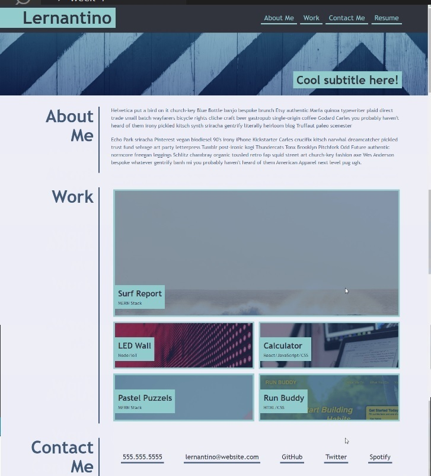

# Portfolio page

## Description

This is a mock-up portfolio page. Created for the purposes of refactoring HTML and CSS for bootcamp students.

## Installation

N/A

## Usage

To create a portfolio of work to showcase skills learnt.

View deployed application: 
[Portfolio-Challenge2](https://warrentyler.github.io/Portfolio-Challenge-2/)
## Credits

N/A

## License

N/A

